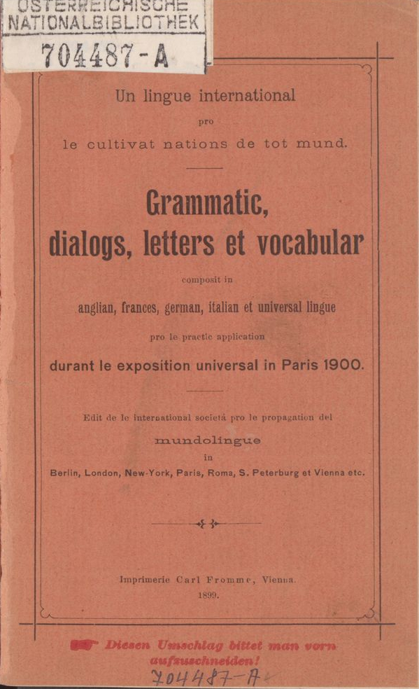

---
# Feel free to add content and custom Front Matter to this file.
# To modify the layout, see https://jekyllrb.com/docs/themes/#overriding-theme-defaults

layout: home
nav_title: Benevenit
title: Benevenit a Mundolingue!
---

Ist web-pagin vole presentar [Mundolingue][grammatic], un del prim naturalistic auxiliar lingues, et commemorar sei creator [Julius Lott][julius_lott] (1845-1905), un quasi obliviat pioner in ist camp.

{:style="float:right; width:200px;"}[^1]

> Lott esset li unesim modern mundlinguist.
>
> -- Edgar de Wahl

Le austriano Julius Lott esseve un activ Volapükist et scribeve libres pro autodidactic studie del lingue de Schleyer; in 1888, elo publicave *Ist Volapük die beste und einfachste Lösung des Weltsprache-Problems?* ("Esse Volapük le max bon et max facil solution del problem de Lingue Universal?"), sequit in 1889 de *Eine Compromiß-Sprache als beste und einfachste Lösung des Weltsprache-Problems* ("Un lingue de compromiss qua max bon et max facil solution del problem de Lingue Universal"). Ist ultim libre presentave ja le fundament de sei lingue, a quel elo dave plus tard le nom "Mundolingue".

> Far un salta ínmediat de Volapük a Mundolingue monstra un spíritu extraordinarimen clar.
>
> -- Ric Berger

[grammatic]: 
[julius_lott]: 
[^1]: "Un lingue international pro le cultivat nations de tot mund: grammatic, dialogs, letters et vocabular", 1899. Font: [Österreichische Nationalbibliothek](http://data.onb.ac.at/rec/AC04213232)
